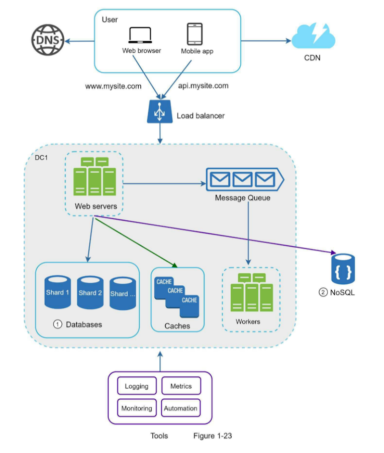

# Scalability Demo

Demo of Scalability as described in Alex Su's Book: System Design Interview, Chapter 1.



In this demo you will see a simple implementation of the architecture. The components are as follow:

- The [Load Balancer](./load-balancer/) is written in Node.Js
- The [Backend](./backend/) is also written in Node.Js
- The [DB](./db/) is Citus, running on Docker.
- The [Cache](./redis/) is Redis, running on Docker.
- The [Message Queue](./rabbitmq/) is Rabbitmq, running on Docker.

# Prerequisites

- Node.Js + Npm
- Docker
- Zrb (Optional. This help you run all services at once)

# Running The Application

If you are using Zrb, you can run the following command.

```bash
zrb start
zrb populate-db # Only need to be executed once.
zrb inspect-db # To inspect database replication (order table is sharded and spread over different db workers)
```

Otherwise, you need to run some docker containers, populate database, and start all services.

To run the docker containers, you need to execute the following command from `redis`, `rabbitmq`, and `db` directory.

```bash
docker compose up
```

Once you do so, you need to populate the database by running the following command from `db`directory.

```bash
./populate.sh
```

Once you populate the database, you can perform inspection to see how `order` table is sharded and spread over db workers.

```bash
./inspect.sh
```

Finally, you need to run `backend`, `load balancer`, and `worker` on their respecting folder with the following command.

```bash
./start.sh
```

Make sure to adjust environment variables as needed when running the services.


# Demo

## Load Balancer

We use a custom Node.js program as load balancer. You can see that your requests will be handled by the backends in a round-robbin manner:

```bash
curl localhost:3000 # will land to SERVER 2
curl localhost:3000 # will land to SERVER 3
curl localhost:3000 # will land to SERVER 1
```

## Messaging

```bash
curl localhost:3000/work?job=doSomething
```

The message will be relayed to rabbitmq, and will be picked up by the `worker`.

## Caching

```bash
curl localhost:3000/orders?id=1
```

If you do the request for the first time, the backend will fetch the data from the database. Once the data has been fetched, it will be cached for the next requests.

We are not covering cache-invalidation in this demo, but the common strategies are as follow.

- Set cache expire time.
- Delete respective cache whenever the data is altered.
